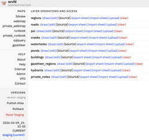
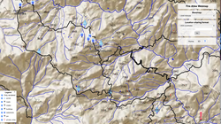

# Stewardship Atlas

The Stewardship Atlas is an open-source, cloud-native platform for turning geospatial analysis into tools that practitioners can act on. The gap between a dataset and a decision is rarely technical — it's the absence of a delivery layer: something that exposes analytical results as decision-ready maps and exports, supports further query and refinement, and produces durable artifacts — web maps, PDF runbooks, GeoPackages, a documented API — without requiring a GIS environment or specialist knowledge. Its modular architecture means adding a new dataset, processing step, or output format is self-contained work rather than a systems integration project.

Atlas is built around the idea that useful data is living data. Ingestion pipelines refresh layers as source assets are revised or new data arrives — from remote-sensing products to field-verified fire and land management observations — so the atlas tracks the current state of a landscape rather than a frozen snapshot. The versioned datastore records every change with full provenance, and community contributions (field photos, ground-truth corrections, incident notes) enter the same refresh cycle. This makes Atlas a natural medium for data-driven conversation: local knowledge and analytical products reconciled in one place, kept current, and accessible to everyone who needs to act on them.

## Use Cases

**Community organizations and emergency services** — A volunteer fire department, fire safe council, or similar org can maintain a living atlas of their area: correcting inaccurate public data, managing sensitive internal records, coordinating field projects, and contributing verified data back to regional or national sources. Field staff access it from a phone browser — no app required.

**Researchers and data practitioners** — Anyone working with geospatial datasets can use Atlas as a processing and publication layer: import from standard formats and external sources, apply transformations and spatial analysis, then export or publish as maps, narratives, or structured datasets.

**Developers and platform builders** — Atlas provides a geospatial data backend with a REST API and standard format I/O, making it straightforward to add geospatial capability to an existing application. Cloud-native by design: S3-backed data, containerizable compute, scale-to-zero when idle.

**Emergency response and incident coordination** — During an active incident, a current atlas provides the situational awareness layer: up-to-date infrastructure, access routes, hazard data, and resource locations — the payoff for keeping data current day-to-day.

**Regional aggregation and planning** — A county agency, regional planning body, or multi-org network can pull together data from multiple contributing organizations into a unified, current picture that no single contributor maintains alone.

## Capabilities

| Capability | Description |
|---|---|
| Interactive web map | MapLibre map with layers, popups, legend, and layer visibility controls |
| 3D terrain view | Vector layers draped on elevation using cloud terrain data |
| Web editing | In-browser feature editing, attribute forms, and photo upload |
| Email photo ingest | Geotagged photos submitted via email become geolocated features |
| PDF runbooks | Print-quality runbooks and atlases via QGIS |
| Road LRS | Linear reference system with mileage markers and segment attributes |
| Conversations | Field comments and observations attached to map features |
| SQL query interface | DuckDB spatial queries across layers from the browser |
| Spreadsheet sync | Google Sheets import/export for tabular layer data |
| COG raster layers | Cloud-optimized GeoTIFFs for custom raster data (canopy density, fuel loads, flow accumulation) |
| Static tile basemaps | PMTiles hillshade for offline-capable deployment |
| Soil and agriculture enrichment | Enrich layers with national soil and agricultural datasets (SSURGO/NRCS) |
| Versioning and audit | Timestamped deltas with full provenance; immutable published snapshots |
| Multi-atlas | Single deployment hosts multiple atlases with shared infrastructure |

## Requirements and Optional Dependencies

**Requirements**

- Python 3.10+
- `geojson`, `shapely`, `requests`

**Optional dependencies**

Install only what your use case needs.

| Capability | Dependency |
|---|---|
| Web API | `fastapi`, `uvicorn` |
| Spatial queries and joins | `duckdb` |
| GeoDataFrame operations | `geopandas` |
| OpenStreetMap inlets | `overpass` |
| Raster processing and tile generation | GDAL (`gdal_translate`, `gdalwarp`, `gdal2tiles`) |
| PMTiles basemap generation | `pmtiles` |
| Cloud-optimized GeoTIFF (COG) serving | GDAL + S3 bucket with public read policy |
| Cloud raster sources (STAC / Planetary Computer) | `pystac-client`, `planetary-computer`, `mercantile` |
| Print atlas and PDF generation | QGIS with PyQGIS |
| Advanced spatial analysis | GRASS GIS |
| Image processing (map sprites) | `Pillow` |
| AWS cloud deployment | `boto3`, AWS account |

**Experimental and edge cases**

These integrations exist in the codebase or are planned but are not part of the standard workflow:

- **Mapnik** — alternative map rendering pipeline (partial implementation)
- **Leaflet** — alternative to the default MapLibre webmap outlet
- **PostGIS** — relational spatial backend, as an alternative to file-based GeoJSON storage
- **Apache Sedona** — distributed spatial processing for large-scale datasets

## Documentation

- [User Guide](documents/user_guide.md)
- [Data Interaction Guide](documents/data_interaction_guide.md)
- [Technical Architecture](documents/atlas_technical_architecture.md)
- [Help](documents/help/)

## Project Status

- [Issue Dashboard](ISSUES.md) — prioritized triage views (priority / area / theme) over the open issues. Generated by `scripts/gen_issue_dashboard.py`.
