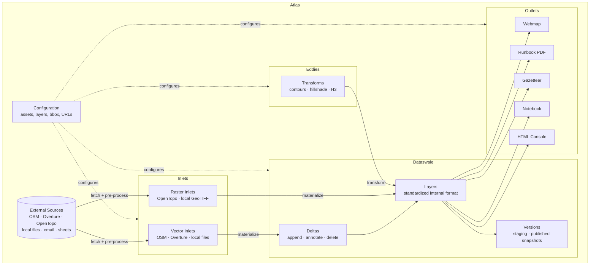

# Atlas and Swale — Architecture Diagram

The **Atlas** is the full system: configuration, inlets, eddies, outlets, and the dataswale. The **Dataswale** is only the storage component — a standardized internal representation of layers. Swapping storage backends (GeoJSON files → S3 → PostGIS) should require no changes to the materialization layer above it.

## Key Distinction

`atlas.materialize()` — Atlas-level. Fetches from an external source, pre-processes, and produces data in a form ready to enter the dataswale. **Does not care how the dataswale stores things.**

`dataswale.refresh_vector_layer()` — Dataswale-level. Applies deltas and writes the canonical layer file. **Does not care where the data came from.**

This separation means:
- A new inlet (e.g. email photo) plugs into the Atlas layer without touching storage
- A new storage backend (e.g. S3, PostGIS) plugs into the Dataswale without touching inlets or outlets
- Eddies sit between: they read from and write to the Dataswale, but are configured and invoked by the Atlas
