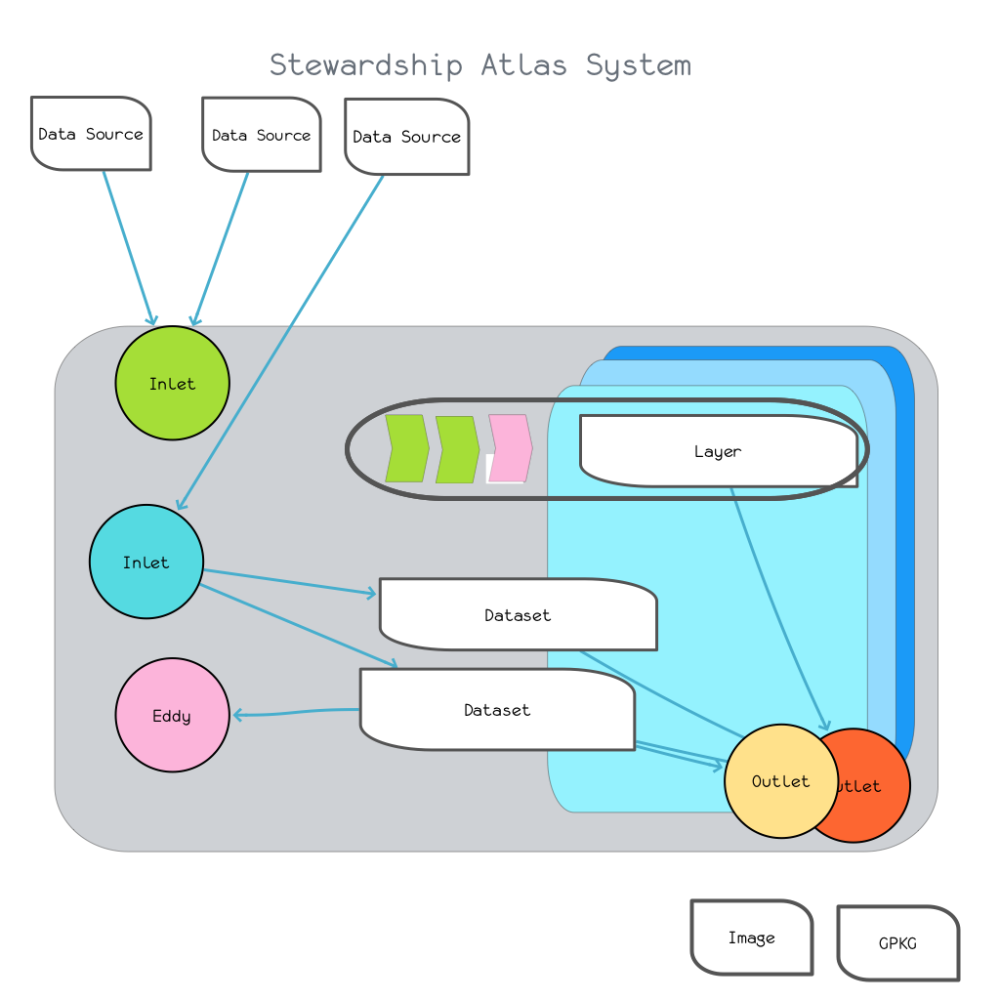

# Stewardship Atlas Technical Specification

  

<!-- {"width":544} -->
# Definitions
* ***Dataswale***: core dataset at the heart of a Stewardship Atlas.
* ***Layer***: A named typed canonicalized dataset in a Dataswale.
* ***Delta***: A standardized “batch” of Geo data to be applied to a Dataswale
* ***Inlet***: A job which generates a Delta from external data sources
* ***Eddy:*** A job which processes a layer in a Dataswale into a new layer
* ***Outlet***: A job which generates some external artifact or representation from a Dataswale
* ***Atlas***: a specific configuration and implementation of all the above.

# Configuration
Configuration is implemented as JSON. Where appropriate , valid GeoJSON should be used - for example, when defining regions for computation or artifacts, they should be simple Polygon Feature Collections. Some templating and interpolation may be used for generating a Stewardship Atlas, but in the end the configuration for it must be a single “flat vanilla” JSON file and kept with the data. We currently store some aspects of Atlas state in the configuration file (eg, versions) which is probably a Bad Idea.
### Dataswale
* name
* description
* bounding box
* cos
* metadata (m/c times, authors, access, etc)
* data_root
* versions (?)
* assets
  * name
  * type (FeatureCollection, raster)
Together with a specific implementation to manage the assets.
## Atlas
* dataswale
* assets
  * in_layers
  * out_layers
  * ~~asset_type: [inlet, outlet, eddy]~~
  * asset_configuration: [asset_config_name or JSON]
  * 

# Implementation 

### Implementation
Possible substrates include:
* geojson in local/cloud files
* GeoParquet in cloud storage 
* local GPKG
* DuckDB/PG

Any implementation should provide some basic shared functionality:
* create/delete a new dataswale
* create new version
* load_asset ( ) -> [feature_set, raster]
* build_asset_from_deltas ( ) ->  [feature_set, raster]
* alter_deltas
* add_deltas

### ## Delta
A FeatureCollection with at target asset. Each feature has AnnotationProperties and AnnotationGeometry.
There are three operations supported - this is specified by a “annotation_type” Property as one of:

AnnotationProperties is a JSON object. It can have the following “special” fields:
* annotation_type: Annotate (default), Create Delete
* annotation_schema: a simple schema describing the fields of the AnnotationProperties.
* annotation_join: specifies how the AnnoGeom will be spatially joined against the asset record geometries, defaulting to SimpleIntersection.
* annotation_timestamp: what it says on the tin. Annos are applied in this order.

Inlets
Inlets take data from somewhere in the world and move it into the Dataswale  as canonically formatted assets. In particular, an `inlet` always generates a Delta associated with a given Asset (or set of assets I suppose). The inlet should do as little processing of the delta as possible so this can be done in one place uniformly when the deltas are applied to their assets.
#### Examples:
* `fetch_uri`
* `fetch_overture`
* `fetch_osm`
* `load_ogr`
* `load_tiff`
	
### Eddy
Eddies process assets into new assets within the dataswale. So they can make a lot of simplifying assumptions about their data, its quality, and formatting.
#### Examples
* `resample_raster`
* `alter_properties`
### Outlet
Outlets process the dataswale into some external artifact. This can be a direct translation of the dataswale into some natural format, like a GPKG; a map or representation of some aspect of the data; or some bit of code or tooling.
